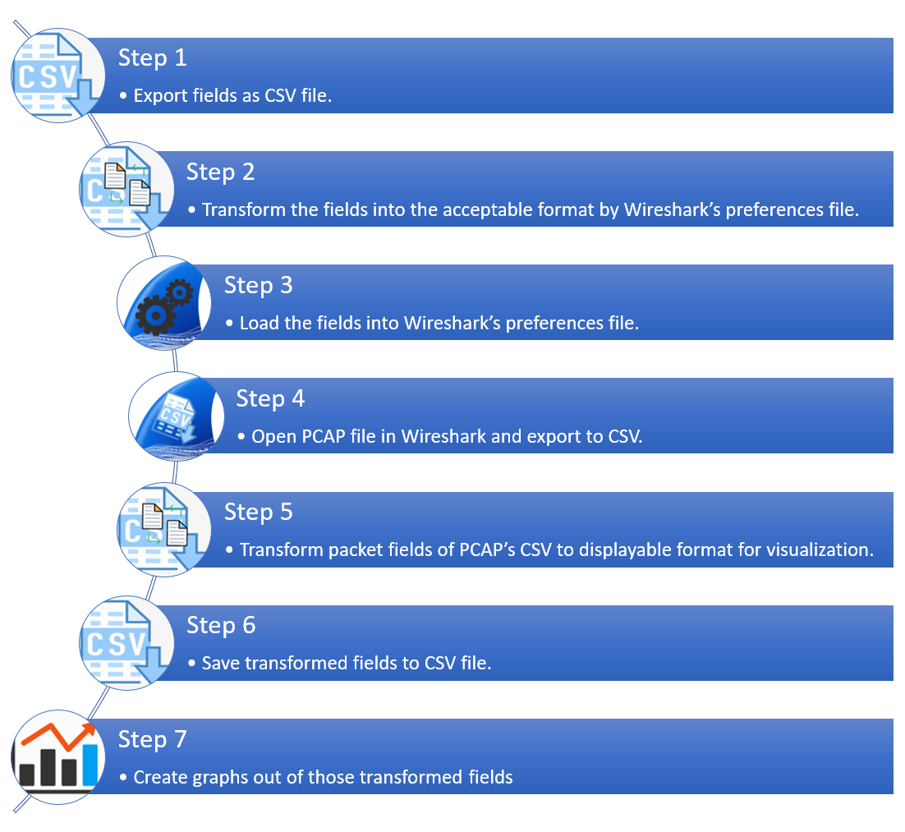
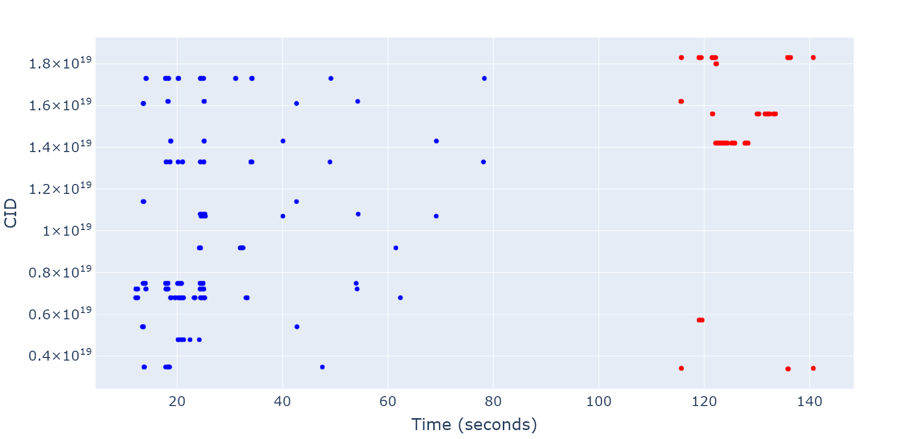
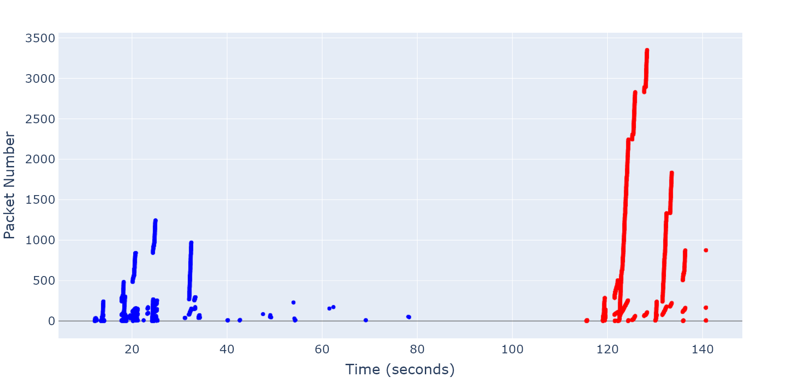

# Visualisation of GQUIC 043 features/fields in graphical plots.
## What is it?
This repository contains scripts that allow easy visualization of GQUIC version 043 (used by Android's youtube app) in graphs using Plotly as graph generator.

This repository contains all the required guidelines and scripts from the donwloading protocol's fields from Wireshark's website to displaying each one of them in graphs.

Wireshark does not make it easy on us, so had to create some utillity scripts to help us transform the data to required formats.
## How do i use it?
### The Flow's outline.


### Dependencies.
- Python 3.6+
    - Jupyter notebook.
    - plotly==4.9.0
    - pandas==1.0.4
    - numpy
    - ~~matplotlib==3.1.2~~ (deprecated dependency)
    - kaleido==0.03

### Step 1: Export fields as CSV file.
All GQUIC fields (or tags) that are supported by Wireshark dissectors can be found in the following URL:
https://www.wireshark.org/docs/dfref/g/gquic.html

Go ahead to "fields-table-to-csv" folder that is available in this repository to start the first step.

HTML table to csv extractor: https://www.convertcsv.com/html-table-to-csv.htm

Open the "HTML table to csv extractor" and insert there as URL the "fields website" to make it generate a CSV file, download the contents into CSV.

### Step 2: Transform the fields to acceptable Wireshark's preferences format.
Run the script found in the jupyer notebook in that directory "csv2wireshark-columns".

*Note: Don't forget to update the filename's path in this script to process the correct file - which is the file downloaded as CSV in previous step.*

``` python
fields = pd.read_csv('./EXPORTED_GQUIC_FIELDS_WIRESHARK.csv')
```


After the running the script, it will produce a CSV file named "wireshark-columns.csv" in the same directory you ran it from, the file contains all GQUIC tags as an acceptable preferences format for wireshark configurations.


### Step 3:  Load the fields into Wireshark"s preferences file.
Go ahead to your Wireshark's preferences file, for Ubuntu and most linux OS's the file can be found at ~/home/<-profile_name->/.config/wireshark.

If you can't find it, then the following link might be useful:
https://www.wireshark.org/docs/wsug_html_chunked/ChAppFilesConfigurationSection.html

After you open the file go to ----- TODO -----
and copy all the exported CSV file to this section and save the file.

Now run Wireshark and make sure that you can see all fields as displayed columns in capture view.

### Step 4: Open PCAP file in Wireshark and export to CSV.
By default (there is no way to change it yet as version 3.3.6), Wireshark exports only the data that is displayed in columns (and in the same format and view), i.e. what you see is what you get.

Therefore, you can add columns and remove columns as you wish and filter only the packets you want to export.

Export all the displayed data to CSV by going to Wireshark's file menu -> Export packet disscetions -> to CSV.
Make sure to uncheck/check some export configuration in the save window to match your personal perferences.

*Note:* in case of very long values, Wireshark by default limits the amount of data displayed to 256, you might want to change the constant value in "column-info.h" from 256 to something larger such as 1024 or 4096 in Wireshark's source code and compile it manually.

### Step 5: Transform packet fields of PCAP’s CSV to displayable format for visualization.
Some of the fields/tags/columns as the same header name, which makes it hard to work with scripts, along with that there are some data saved in hexa-decimal format which canno't be displayed by Plotly graphing library, therefore we need to convert those to decimal, and maybe normalize them too if they are too large.

Go ahead to the "csv-preprocess" directory that can be found in this repository to find the scripts that transforms the CSV values to formats that can be correctly visualized by Plotly later on.

There you can find the main script "hex-main.py", make sure you have all dependencies installed, you may configure the constants
imports to match your preferences as you like.
``` python
CSV_DIR  = './input/'
CSV_OUT  = './output/'
```

The script is searching for ".csv" files in the directory defined in CSV_DIR and outputs the modified/transformed files to the directory CSV_OUT.

### Step 6: Save transformed fields to CSV file.
The script in the previous step takes care for saving the transformed CSV file, just make sure that you define CSV_OUT, you might need to create those folders by hand first.

### Step 7: Create graphs out of those transformed fields
Go ahead to "graphs" directory which can be found in this repository.

There you'll find a python script named "main.py", update the filepath to point to the transformed CSV file.
``` python
CSV_FILE = './csv-preprocess/output/record_22_inside.csv'
```
### Example end results




## Authors
By students, for Ariel University.